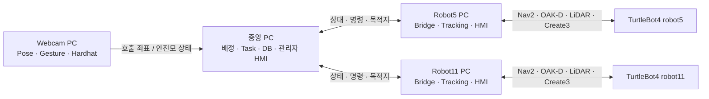
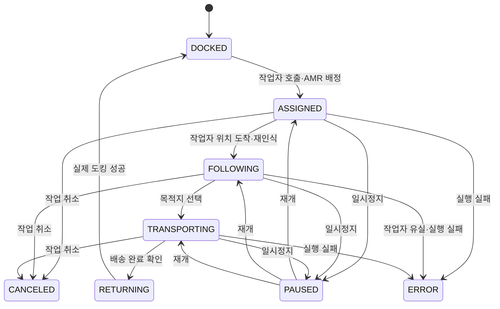

# PATHBOT

다중 AMR 기반 건설현장 작업자 지원·자재 운반 시스템입니다. 고정 웹캠에서 작업자의 수신호와 위치를 인식하고, 중앙 PC가 가용 AMR을 배정합니다. 배정된 TurtleBot4는 작업자 위치로 이동한 뒤 OAK-D와 LiDAR를 이용해 작업자를 추종하며, 로봇 탑재 HMI에서 목적지를 선택하면 배송·복귀·도킹까지 수행합니다.

이 문서는 `PATH_BOT_MAIN.zip`에 포함된 실제 코드와 설정을 기준으로 작성했습니다.

## 1. 시스템 구성

| 구분 | 주요 역할 | 관련 경로 |
| --- | --- | --- |
| Webcam PC | 영상 발행, YOLO-Pose 작업자 위치 추정, 손 제스처 호출, 안전모 판별 | `src/webcam_PC/` |
| 중앙 PC | AMR 배정, Task 상태 관리, SQLite 기록, 목적지 배포, 관리자 HMI 백엔드 | `src/main_PC/` |
| Robot5 PC | Robot5 브릿지, 사람 추적, 탑재 HMI 백엔드 | `src/robot_PC/` |
| Robot11 PC | Robot11 브릿지, 사람 추적, 탑재 HMI 백엔드 | `src/robot_PC/` |
| 관리자 HMI | 로봇·지도·영상·DB 확인, 작업 취소, 비상정지, 제한적 수동 제어 | `amr_delivery_ui/frontend/` |
| 로봇 탑재 HMI | 배송 목적지 선택, 일시정지·재개, 배송 완료, 복귀 요청 | `robot_hmi_ui/` |



## 2. 핵심 동작 흐름

1. Webcam PC가 `/camera/image_raw/compressed`로 영상을 발행합니다.
2. `pose_locator_node`가 YOLO-Pose와 Homography를 이용해 작업자의 발 위치를 `map` 좌표로 변환합니다.
3. `wrist_gesture_node`가 `OPEN → CLOSED → OPEN` 손동작을 확인하면 `/person/call_trigger`를 발행합니다.
4. `pose_locator_node`가 현재 락온된 작업자의 최신 좌표를 `/person/call_position`으로 발행합니다.
5. 중앙 `robot_assignment_node`가 통신 상태, Task 상태, 배터리, 거리와 방향을 비교해 Robot5 또는 Robot11을 배정합니다.
6. 중앙 `task_manager_node`가 실제 Undock 성공을 확인한 뒤 작업자 앞 안전 정지점으로 Nav2 Goal을 보냅니다.
7. 도착 후 Robot PC의 OAK-D·LiDAR 추적 파이프라인이 작업자를 다시 확인하고 `FOLLOWING`으로 전환합니다.
8. 로봇 탑재 HMI에서 중앙 DB에 등록된 목적지를 선택하면 `TRANSPORTING`으로 전환합니다.
9. 목적지 도착 후 작업자가 배송 완료를 확인하면 `RETURNING`으로 전환하고 복귀·도킹합니다.

> `/person/position`은 연속 위치 확인용입니다. 실제 AMR 배정은 수신호가 확정된 순간 발행되는 `/person/call_position`을 사용합니다.

## 3. Task 상태

기본 정상 흐름은 다음과 같습니다.



- `PAUSED`: 이전 상태를 보존한 일시정지 상태
- `CANCELED`: 현재 위치에서 작업을 취소하고 정지한 상태
- `ERROR`: Nav2, 도킹, 추종 유실 등의 실패 상태
- 관리자 수동 주행·수동 도킹은 코드상 `CANCELED` 또는 `ERROR`에서만 허용됩니다.
- DB의 `tasks.state`에는 최종 도킹 완료가 `COMPLETED`로 기록됩니다.

## 4. 디렉터리 구조

```text
PATH_BOT_MAIN/
├── amr.db                         # 중앙 SQLite DB 및 기본 목적지 4개
├── maps/
│   ├── map2.pgm
│   └── map2.yaml
├── amr_delivery_ui/frontend/      # 중앙 관리자 React HMI
├── robot_hmi_ui/                  # Robot5/Robot11 공용 React HMI
└── src/
    ├── webcam_PC/
    │   ├── person_locator/        # 카메라, YOLO-Pose, Homography, 호출 좌표
    │   ├── hand_gesture_caller/   # MediaPipe 손 제스처 인식
    │   └── hardhat_detector/      # 작업자 안전모 판별
    ├── main_PC/
    │   ├── robot_status/          # 공용 커스텀 ROS 2 메시지
    │   └── robot_manager/         # 배정·Task·DB·목적지·관리자 API
    └── robot_PC/
        ├── robot_status/          # Robot PC용 동일 메시지 정의
        ├── robot_bridge/          # 중앙 Task와 Nav2/Create3 연결
        ├── amr_person_tracking/   # OAK-D·LiDAR·ReID·예측 회피
        └── robot_hmi_backend/     # 로봇 탑재 HMI API
```

## 5. 요구 환경

### 공통

- Ubuntu 22.04
- ROS 2 Humble
- Python 3
- `colcon`, `rosdep`
- 모든 PC에서 동일한 ROS Domain 및 통신 설정

### Robot PC 추가 요구사항

- TurtleBot4 / Create3 드라이버
- Nav2 및 AMCL
- OAK-D Pro RGB-D 토픽
- RPLIDAR LaserScan 토픽
- `ultralytics`, OpenCV, NumPy, SciPy

### Webcam PC 추가 요구사항

- USB Webcam
- `ultralytics`, MediaPipe, OpenCV, NumPy, PyYAML

### 웹 UI

두 프론트엔드 모두 Vite 8을 사용하므로 다음 Node.js 버전이 필요합니다.

- Node.js `^20.19.0` 또는 `>=22.12.0` (`package-lock.json`의 Vite 요구 버전)
- npm

## 6. 먼저 확인할 중요 사항

### 6.1 PC 역할별로 따로 빌드

`src/main_PC`와 `src/robot_PC`에는 동일한 패키지 이름인 `robot_status`가 각각 들어 있습니다. 각 PC에는 자신에게 필요한 역할 디렉터리만 빌드하십시오. 저장소 전체의 `src`를 한꺼번에 빌드하지 않는 것을 권장합니다.

### 6.2 모델 가중치는 ZIP에 포함되지 않음

`.gitignore` 정책에 따라 `.pt`와 `.onnx` 파일이 ZIP에 없습니다. 최소한 다음 모델이 필요합니다.

| 용도 | 권장 파일 | 사용하는 실행 인자 |
| --- | --- | --- |
| Webcam 작업자 Pose | `yolo11n-pose.pt` | `person_locator`의 `model_path` |
| 안전모 판별 | 학습된 `detect_warn_yolo11n_best.pt` 또는 호환 모델 | `hardhat_detector`의 `model_path` |
| Robot OAK-D 작업자 Pose | `yolo11n-pose.pt` | `robot.launch.py`의 `pose_model_path` |
| 외형 임베딩 | ReID ONNX 모델, 선택 사항 | `reid_model_path` |

가장 안전한 방법은 모델을 각 PC의 고정 경로에 보관하고 실행할 때 절대 경로를 전달하는 것입니다.

### 6.3 이 ZIP에는 TurtleBot4/Nav2/OAK-D Bringup이 없음

`robot.launch.py`는 PATHBOT 응용 노드만 실행합니다. 다음 하드웨어·주행 토픽과 액션 서버는 별도의 TurtleBot4/Nav2/OAK-D Bringup에서 먼저 제공되어야 합니다.

- `/<robot_id>/amcl_pose`, `battery_state`, `odom`, `scan`, `tf`, `tf_static`
- `/<robot_id>/oakd/rgb/image_raw/compressed`
- `/<robot_id>/oakd/stereo/image_raw/compressedDepth`
- `/<robot_id>/oakd/rgb/camera_info`
- `/<robot_id>/navigate_to_pose`, `spin`, `dock`, `undock`

## 7. 공통 ROS 2 통신 설정

각 PC의 터미널에서 같은 값을 사용합니다. 아래 Domain ID는 예시이므로 현장 설정에 맞게 변경하십시오.

```bash
source /opt/ros/humble/setup.bash
export ROS_DOMAIN_ID=11
export ROS_LOCALHOST_ONLY=0
```

Fast DDS Discovery Server를 사용한다면 모든 PC에 같은 서버를 지정합니다.

```bash
export ROS_DISCOVERY_SERVER=192.168.0.10:11811
```

Discovery Server를 사용하지 않는 시험 환경에서는 Robot launch에 `require_discovery_server:=false`를 전달할 수 있습니다.

## 8. 설치 및 빌드

아래 명령은 각 PC에 `PATH_BOT_MAIN` 폴더가 별도로 복사되어 있다고 가정합니다.

### 8.1 공통 도구

```bash
sudo apt update
sudo apt install -y python3-colcon-common-extensions python3-rosdep python3-pip
source /opt/ros/humble/setup.bash
```

`rosdep`을 처음 사용하는 PC에서만 초기화합니다.

```bash
sudo rosdep init
rosdep update
```

이미 초기화된 PC에서는 `sudo rosdep init`을 다시 실행할 필요가 없습니다.

### 8.2 중앙 PC

```bash
cd ~/PATH_BOT_MAIN
source /opt/ros/humble/setup.bash
rosdep install --from-paths src/main_PC --ignore-src -r -y
colcon build --base-paths src/main_PC --symlink-install
source install/setup.bash
```

### 8.3 Webcam PC

```bash
cd ~/PATH_BOT_MAIN
source /opt/ros/humble/setup.bash
rosdep install --from-paths src/webcam_PC --ignore-src -r -y
python3 -m pip install ultralytics mediapipe opencv-python numpy pyyaml
colcon build --base-paths src/webcam_PC --symlink-install
source install/setup.bash
```

### 8.4 Robot5 / Robot11 PC

두 Robot PC에 동일한 소스를 배포하고 실행 시 `robot_id`만 다르게 지정합니다.

```bash
cd ~/PATH_BOT_MAIN
source /opt/ros/humble/setup.bash
rosdep install --from-paths src/robot_PC --ignore-src -r -y
python3 -m pip install "numpy>=2.0,<2.3" "scipy>=1.14,<1.16" \
  "opencv-python>=4.10,<6" "ultralytics>=8.3,<9"
colcon build --base-paths src/robot_PC --symlink-install
source install/setup.bash
```

별도 ReID 임베딩을 활성화할 때만 다음 중 하나를 추가합니다.

```bash
python3 -m pip install "onnxruntime>=1.20,<2"
# NVIDIA GPU 사용 시 환경에 맞춰 onnxruntime-gpu 사용
```

CUDA를 사용할 경우에는 호스트 NVIDIA 드라이버에 맞는 PyTorch와 torchvision을 먼저 설치하십시오.

## 9. 실행 방법

각 새 터미널에서 다음 두 명령을 먼저 실행해야 합니다.

```bash
source /opt/ros/humble/setup.bash
source ~/PATH_BOT_MAIN/install/setup.bash
```

### 9.1 Robot5 PC

먼저 기존 TurtleBot4/Nav2/OAK-D Bringup을 `robot5` 네임스페이스로 실행합니다. 필요한 토픽과 액션이 확인되면 다음을 실행합니다.

```bash
ros2 launch robot_bridge robot.launch.py \
  robot_id:=robot5 \
  pose_model_path:=/absolute/path/to/yolo11n-pose.pt
```

카메라·LiDAR 없이 브릿지와 HMI만 점검하려면 다음과 같이 실행합니다.

```bash
ros2 launch robot_bridge robot.launch.py \
  robot_id:=robot5 \
  enable_person_tracking:=false
```

기본 HMI 백엔드 포트는 `8005`입니다.

### 9.2 Robot11 PC

먼저 기존 TurtleBot4/Nav2/OAK-D Bringup을 `robot11` 네임스페이스로 실행합니다.

```bash
ros2 launch robot_bridge robot.launch.py \
  robot_id:=robot11 \
  pose_model_path:=/absolute/path/to/yolo11n-pose.pt
```

기본 HMI 백엔드 포트는 `8011`입니다.

### 9.3 로봇 Dock 초기 위치 저장

RViz의 `2D Pose Estimate`로 실제 Dock 위치를 맞춘 뒤 아래 명령을 한 번 실행합니다.

```bash
ros2 run robot_bridge capture_initial_pose --ros-args -p robot_id:=robot5
```

Robot11에서는 `robot_id`를 변경합니다.

```bash
ros2 run robot_bridge capture_initial_pose --ros-args -p robot_id:=robot11
```

기본 저장 위치는 다음과 같습니다.

```text
~/.config/team4_amr_assist/initial_poses.yaml
```

### 9.4 중앙 PC

보안을 위해 관리자 계정 환경변수를 먼저 변경하는 것을 권장합니다. 설정하지 않으면 코드 기본값은 `rokey / 1234`입니다.

```bash
cd ~/PATH_BOT_MAIN
export HMI_USERNAME=pathbot_admin
export HMI_PASSWORD='CHANGE_THIS_PASSWORD'
export AMR_DB_PATH="$PWD/amr.db"
export AMR_MAP_YAML="$PWD/maps/map2.yaml"

ros2 launch robot_manager central_system.launch.py \
  db_path:="$AMR_DB_PATH" \
  map_yaml_path:="$AMR_MAP_YAML" \
  camera_topic:=/camera/image_raw/compressed
```

이 Launch는 다음 노드를 실행합니다.

- `robot_assignment_node`
- `task_manager_node`
- `destination_manager_node`
- `hmi_backend_node` — 관리자 API `0.0.0.0:8000`
- `db_manager_node`

### 9.5 Webcam PC

Webcam 파이프라인은 하나의 통합 Launch가 아니라 다음 프로세스를 각각 실행하는 구조입니다.

터미널 1 — 카메라 영상 발행:

```bash
ros2 run person_locator camera_publisher --ros-args \
  -p device:=0 \
  -p capture_width:=640 \
  -p capture_height:=480 \
  -p fps:=15.0
```

터미널 2 — YOLO-Pose 및 Homography 위치 추정:

```bash
ros2 launch person_locator person_locator.launch.py \
  model_path:=/absolute/path/to/yolo11n-pose.pt \
  homography_yaml_path:=/absolute/path/to/person_homography_cam1.yaml
```

ZIP에 포함된 Homography를 그대로 사용한다면 원본 파일은 다음 위치에 있습니다.

```text
src/webcam_PC/person_locator/config/person_homography_cam1.yaml
```

카메라 위치·각도 또는 지도 원점이 바뀌면 반드시 다시 캘리브레이션해야 합니다.

터미널 3 — 손 제스처 호출:

```bash
ros2 run hand_gesture_caller wrist_gesture_node
```

터미널 4 — 안전모 판별:

```bash
ros2 launch hardhat_detector hardhat_detector.launch.py \
  model_path:=/absolute/path/to/detect_warn_yolo11n_best.pt \
  positive_class_name:=helmet
```

## 10. 웹 UI 실행

### 10.1 중앙 관리자 HMI

```bash
cd ~/PATH_BOT_MAIN/amr_delivery_ui/frontend
npm ci
npm run dev -- --port 5173
```

브라우저에서 다음 주소를 엽니다.

```text
http://<MAIN_PC_IP>:5173
```

프론트엔드와 중앙 백엔드가 다른 장비에 있다면 `amr_delivery_ui/frontend/.env.local`에 다음 값을 설정합니다.

```dotenv
VITE_API_BASE=http://<MAIN_PC_IP>:8000
```

관리자 화면은 현재 중앙 API의 `/api/camera/frame`에서 Webcam PC의 최신 한 프레임을 반복 조회합니다. `amr_delivery_ui/frontend/.env.example`의 개별 스트림 URL 변수는 현재 `App.jsx`에서 사용하지 않습니다.

### 10.2 Robot5 탑재 HMI

Robot5 PC에서 실행합니다.

```bash
cd ~/PATH_BOT_MAIN/robot_hmi_ui
npm ci
npm run dev:robot5 -- --port 5180
```

```text
http://<ROBOT5_PC_IP>:5180
```

### 10.3 Robot11 탑재 HMI

Robot11 PC에서 실행합니다.

```bash
cd ~/PATH_BOT_MAIN/robot_hmi_ui
npm ci
npm run dev:robot11 -- --port 5180
```

```text
http://<ROBOT11_PC_IP>:5180
```

탑재 HMI 프론트엔드가 Robot PC와 다른 장비에서 실행된다면 `.env.robot5` 또는 `.env.robot11`의 `VITE_HMI_API_URL`을 실제 Robot PC 주소로 설정합니다.

## 11. 주요 ROS 2 인터페이스

| 이름 | 형식 | 방향 | 용도 |
| --- | --- | --- | --- |
| `/camera/image_raw/compressed` | `sensor_msgs/CompressedImage` | Webcam → Vision·중앙 HMI | 고정 웹캠 JPEG 영상 |
| `/person/position` | `geometry_msgs/PointStamped` | Webcam Vision → 모니터링 | 연속 작업자 `map` 위치 |
| `/person/call_trigger` | `std_msgs/Empty` | Gesture → Person Locator | 호출 제스처 확정 |
| `/person/call_position` | `geometry_msgs/PointStamped` | Person Locator → 중앙 | 배정에 사용하는 호출 위치 |
| `/person/hardhat_status` | `std_msgs/Bool` | Hardhat → 중앙 | 안전모 착용 여부 |
| `/robot_status` | `robot_status/RobotStatus` | Robot PC → 중앙·HMI | 위치·배터리·Robot ID, 1 Hz |
| `/robot_assignment` | `robot_status/RobotAssignment` | 중앙 배정 → Task·DB | 배정 결과와 접근 좌표 |
| `/task/command` | `robot_status/TaskCommand` | HMI·Bridge → 중앙 Task | 상태 전환·제어 요청 |
| `/task/state` | `robot_status/TaskState` | 중앙 Task → 전체 | 현재 Task 상태 |
| `/destinations` | `robot_status/DestinationList` | 중앙 DB → Task·Robot HMI | 목적지 ID와 좌표 목록 |
| `/navigation/result` | `robot_status/NavigationResult` | Robot Bridge → 중앙 | Nav2·Dock·Undock 결과 |
| `/robot_error` | `robot_status/RobotError` | 중앙·Robot → Task·DB·HMI | 오류 코드 기록 |
| `/<robot_id>/target_person_pose` | `geometry_msgs/PoseStamped` | Tracking → Bridge | 추종 대상 `map` Pose |
| `/<robot_id>/pause/request` | `std_msgs/Bool` | 중앙 Task → Bridge | 로컬 추종 정지 |
| `/<robot_id>/dock/request` | `std_msgs/Bool` | 중앙 Task → Bridge | Dock 또는 Undock 요청 |
| `/<robot_id>/navigate_to_pose` | `nav2_msgs/action/NavigateToPose` | 중앙·Bridge → Nav2 | 접근·배송·복귀·추종 |
| `/<robot_id>/spin` | `nav2_msgs/action/Spin` | Bridge → Nav2 | 작업자 유실 시 회전 탐색 |
| `/<robot_id>/dock`, `undock` | Create3 Actions | Bridge → Create3 | 실제 도킹·언도킹 |

## 12. 웹 API 및 포트

| 대상 | 기본 포트 | 주요 API |
| --- | ---: | --- |
| 중앙 관리자 백엔드 | `8000` | 로그인, 로봇·지도·목적지·카메라·DB, 취소·E-Stop·Dock·Teleop |
| 중앙 관리자 프론트엔드 | `5173` | React/Vite 개발 서버 |
| Robot5 HMI 백엔드 | `8005` | 상태·목적지·배송·정지·재개·복귀, WebSocket |
| Robot11 HMI 백엔드 | `8011` | 상태·목적지·배송·정지·재개·복귀, WebSocket |
| 각 Robot HMI 프론트엔드 | `5180` | React/Vite 개발 서버 |

중앙 관리자 API의 주요 경로:

```text
POST /api/auth/login
GET  /api/robots
GET  /api/map
GET  /api/destinations
GET  /api/camera/frame
GET  /api/database/tables
GET  /api/database/table/{table_name}
POST /api/robot/{robot_id}/estop
POST /api/robot/{robot_id}/dock
POST /api/robot/{robot_id}/cancel
POST /api/robot/{robot_id}/teleop
POST /api/robot/{robot_id}/teleop/mode
```

Robot HMI API의 주요 경로:

```text
GET  /api/status
GET  /api/destinations
POST /api/delivery/start
POST /api/task/pause
POST /api/task/resume
POST /api/delivery/complete
POST /api/return-to-dock
WS   /ws/status
```

## 13. 데이터베이스

SQLite 파일은 저장소 루트의 `amr.db`입니다.

| 테이블 | 내용 |
| --- | --- |
| `robot_status_logs` | Robot ID, 온라인 상태, Task 상태, 배터리, 위치, Yaw, 기록 시각 |
| `tasks` | Task ID, 배정 로봇, 목적지, 상태, 결과, 생성·완료 시각, 소요 시간 |
| `destinations` | 목적지 ID·이름과 Nav2 `map` 좌표 |
| `error_logs` | Robot ID, Task ID, 오류 코드, 발생 시각 |

기본 목적지:

| ID | 이름 | X | Y |
| --- | --- | ---: | ---: |
| `1` | 원자재 입고구역 | `-4.22` | `-4.64` |
| `2` | 조립 공정구역 | `-2.07` | `0.55` |
| `3` | 품질검사구역 | `-0.07` | `-2.80` |
| `4` | 완제품 출하구역 | `-4.60` | `-2.00` |

운영 전 원본 DB를 백업하고, 모든 중앙 노드가 동일한 절대 DB 경로를 사용하도록 `AMR_DB_PATH` 또는 `db_path`를 지정하는 것을 권장합니다.

## 14. 주요 기본값

| 항목 | 코드 기본값 |
| --- | ---: |
| Robot 상태 유효 시간 | `5.0 s` |
| 배정 최소 배터리 | `20 %` |
| 사람 앞 접근 정지 거리 | `0.6 m` |
| 중복 호출 판정 | `10 s`, `0.5 m` |
| 추종 거리 | `0.9 m` |
| 추종 Goal 갱신 | 최대 `1 Hz` |
| 작업자 유실 Grace | `2.0 s` |
| 작업자 재탐색 제한 | `60.0 s` |
| 제스처 호출 Cooldown | `2.0 s` |
| 관리자 Teleop 제한 | 선속도 `0.25 m/s`, 각속도 `1.0 rad/s` |

## 15. 검증 명령

### ROS 2 통신

```bash
ros2 topic hz /camera/image_raw/compressed
ros2 topic echo /person/call_position
ros2 topic echo /robot_status
ros2 topic echo /task/state
ros2 topic echo /robot_error
ros2 action list
```

로봇별 센서·액션 확인 예시:

```bash
ros2 topic hz /robot5/amcl_pose
ros2 topic hz /robot5/battery_state
ros2 topic hz /robot5/oakd/rgb/image_raw/compressed
ros2 topic hz /robot5/scan
ros2 action list | grep robot5
```

### 관리자 UI

```bash
cd ~/PATH_BOT_MAIN/amr_delivery_ui/frontend
npm run build
npm run lint
```

### Robot HMI

```bash
cd ~/PATH_BOT_MAIN/robot_hmi_ui
npm test
npm run build:robot5
npm run build:robot11
```

백엔드와 브라우저 실행 환경이 준비된 경우 E2E 테스트도 실행할 수 있습니다.

```bash
npm run test:e2e:robot5
npm run test:e2e:robot11
```

### ROS 패키지 테스트

중앙 PC:

```bash
colcon test --packages-select robot_manager
colcon test-result --verbose
```

Robot PC:

```bash
colcon test --packages-select robot_bridge robot_hmi_backend amr_person_tracking
colcon test-result --verbose
```

## 16. 문제 해결

### `Package '...' not found`

빌드한 역할이 맞는지 확인하고 새 터미널에서 Setup 파일을 다시 불러옵니다.

```bash
source /opt/ros/humble/setup.bash
source ~/PATH_BOT_MAIN/install/setup.bash
```

### 모델 파일을 찾지 못함

ZIP에는 가중치가 없습니다. Launch 명령의 `model_path` 또는 `pose_model_path`에 실제 절대 경로를 전달하십시오.

### `/robot_status`가 나오지 않음

- `/<robot_id>/amcl_pose`와 `/<robot_id>/battery_state`가 모두 발행되는지 확인합니다.
- 모든 PC의 `ROS_DOMAIN_ID`, `ROS_LOCALHOST_ONLY`, Discovery Server 설정을 비교합니다.
- Robot ID가 정확히 `robot5` 또는 `robot11`인지 확인합니다.

### 작업자 호출은 나오지만 AMR이 배정되지 않음

- `/person/call_position.header.frame_id`가 `map`인지 확인합니다.
- 호출 좌표가 `map2`의 검은 벽 내부 자유 공간인지 확인합니다.
- 최신 Robot 상태가 5초 이내인지 확인합니다.
- Task 상태가 `DOCKED`인지 확인합니다.
- 배터리가 20% 이상인지 확인합니다.
- 사람 앞 0.6 m 안전 정지점이 지도 내부인지 확인합니다.

### HMI가 백엔드에 연결되지 않음

- 중앙: `8000`, Robot5: `8005`, Robot11: `8011` 포트를 확인합니다.
- 프론트엔드 환경변수의 IP가 백엔드 PC의 실제 IP인지 확인합니다.
- 브라우저 PC와 백엔드 PC 사이의 방화벽을 확인합니다.
- 중앙 로그인 계정은 백엔드를 실행한 터미널의 `HMI_USERNAME`, `HMI_PASSWORD` 값을 사용합니다.

### OAK-D 검출은 되지만 추종이 시작되지 않음

- `/<robot_id>/target_person_pose`가 `map` 프레임으로 발행되는지 확인합니다.
- `/<robot_id>/tf`와 `/<robot_id>/tf_static`이 존재하는지 확인합니다.
- Task가 작업자 위치에 도착해 `ASSIGNED`의 `goal_completed=true`가 되었는지 확인합니다.
- `pose_model_path`와 `tracker_config_path`를 확인합니다.

### Robot11 초기 위치 오류

Robot11은 저장된 Dock Pose가 없으면 자동 초기화가 실패할 수 있습니다. RViz에서 위치를 지정한 후 `capture_initial_pose`로 저장하십시오.

### Discovery Server 경고

현장에서 Discovery Server를 사용한다면 `ROS_DISCOVERY_SERVER`를 설정합니다. 사용하지 않는 시험 환경이라면 다음 옵션을 사용합니다.

```bash
ros2 launch robot_bridge robot.launch.py \
  robot_id:=robot5 \
  enable_person_tracking:=false \
  require_discovery_server:=false
```

## 17. 현재 코드 기준 주의사항

- `robot_status` 메시지 정의가 중앙 PC와 Robot PC에 복제되어 있습니다. 한쪽을 수정하면 다른 쪽의 `.msg`도 동일하게 변경해야 합니다.
- `robot.launch.py`는 Nav2, AMCL, TurtleBot4 Bringup 또는 OAK-D 드라이버를 실행하지 않습니다.
- 모델 가중치와 데이터셋은 포함되지 않았습니다.
- Homography는 현재 고정된 카메라 위치와 `map2` 좌표계에서만 유효합니다.
- 중앙 Task Manager의 Robot11 복귀 좌표와 Robot Bridge의 초기 Pose 기본값은 서로 다릅니다. 현장 Dock 위치를 다시 측정해 중앙 `robot11_dock_pose`와 Robot PC의 저장 Pose를 일치시키는 것이 안전합니다.
- `robot_bridge_node`와 별도 `initial_pose_publisher_node`가 모두 초기 Pose 발행 기능을 가지고 있으므로, 현장에서는 저장된 Pose가 일관되게 설정되었는지 확인해야 합니다.
- 중앙 관리자 기본 로그인 정보는 개발용입니다. 실제 네트워크에서는 반드시 환경변수로 변경하십시오.
- 각 ROS 패키지는 `Apache-2.0`을 선언하지만 저장소 루트에는 별도의 `LICENSE` 파일이 없습니다.

## 18. 빠른 실행 순서 요약

1. 네 PC의 ROS Domain·Discovery 설정을 통일합니다.
2. Robot5/Robot11에서 TurtleBot4, Nav2, AMCL, OAK-D, LiDAR Bringup을 실행합니다.
3. Robot5/Robot11에서 각각 `robot.launch.py`를 실행합니다.
4. 중앙 PC에서 `central_system.launch.py`를 실행합니다.
5. Webcam PC에서 카메라, Pose Locator, Gesture, Hardhat 노드를 실행합니다.
6. 중앙 관리자 HMI와 각 Robot HMI 프론트엔드를 실행합니다.
7. `/robot_status`, `/person/call_position`, `/task/state`를 확인한 뒤 시연합니다.
