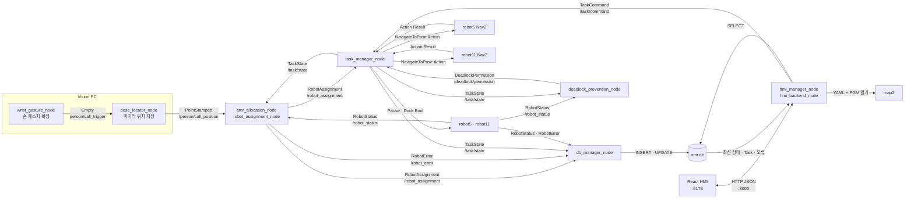
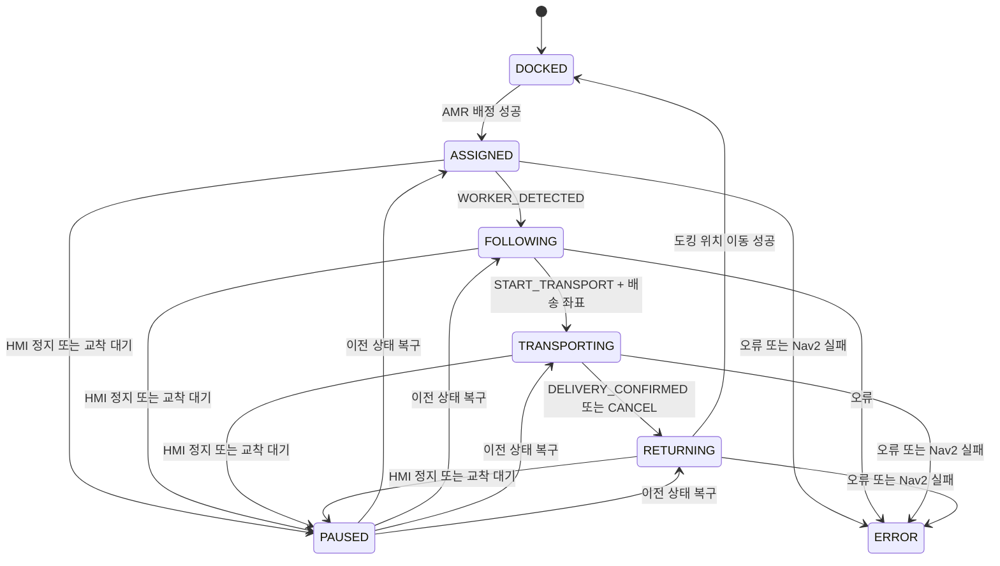
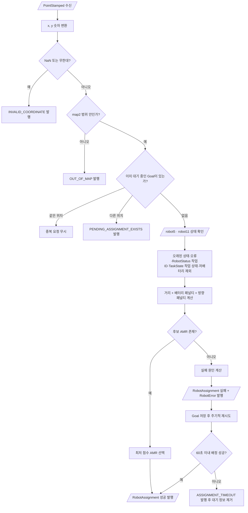
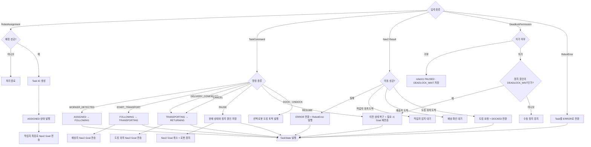
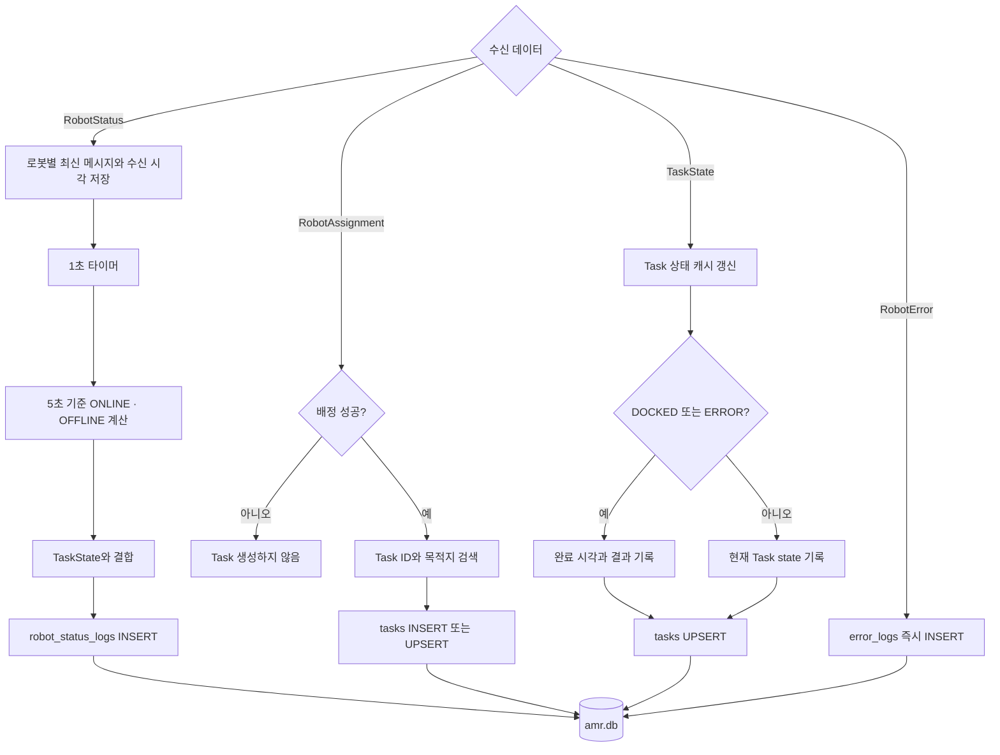
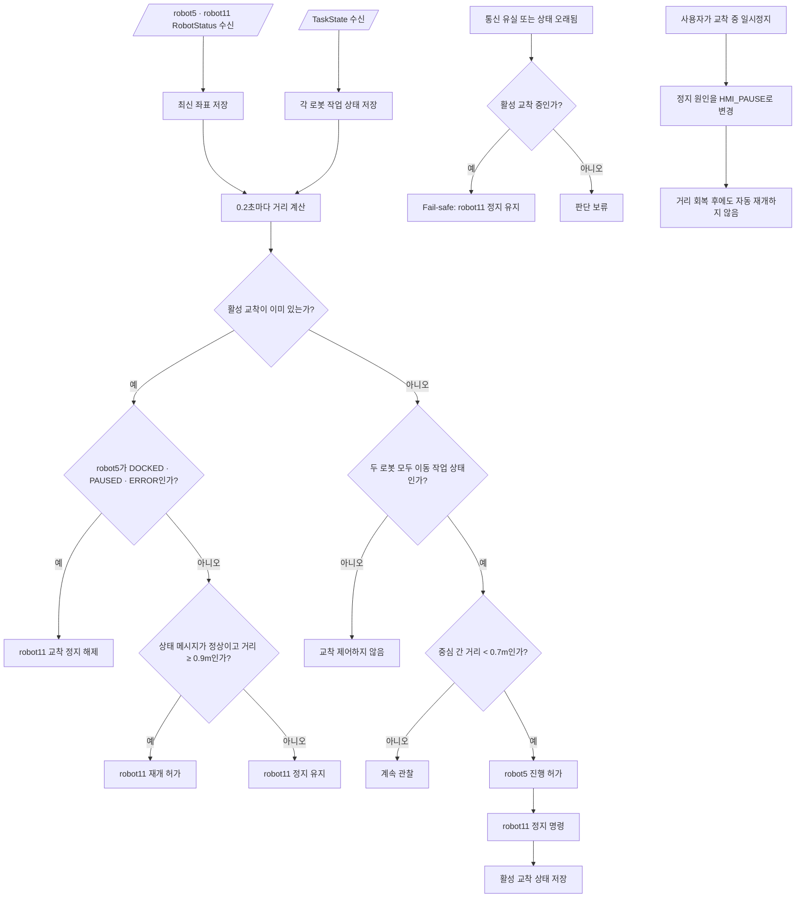

# 중앙 PC 5개 노드 구조 및 데이터 흐름

## 1. 중앙 시스템 전체 구조



## 2. 핵심 데이터 이동표

| 송신 노드 | 데이터 | ROS 이름 | 수신 노드 | 용도 |
|---|---|---|---|---|
| wrist_gesture_node | `Empty` | `/person/call_trigger` | pose_locator_node (Vision PC 내부) | 손 제스처 확정 순간을 트리거해 마지막 위치를 발행하게 함 |
| pose_locator_node | `PointStamped` | `/person/call_position` | Allocation | 제스처 확정 시점에 저장해둔 작업자 호출 좌표 전달 |
| robot5, robot11 | `RobotStatus` | `/robot_status` | Allocation, DB, Deadlock | 위치·방향·배터리·작업 ID 전달 |
| Allocation | `RobotAssignment` | `/robot_assignment` | Task, DB | 배정 성공 여부·로봇 ID·목표 좌표 전달 |
| Allocation, Task, Robot | `RobotError` | `/robot_error` | Task, DB | 오류 상태 전환 및 DB 기록 |
| HMI | `TaskCommand` | `/task/command` | Task | PAUSE, RESUME, DOCK, UNDOCK 등 사용자 명령 |
| Task | `TaskState` | `/task/state` | Allocation, DB, Deadlock | 재배정 차단, DB 기록, 교착 판단 |
| Task | `NavigateToPose.Goal` | `/robot5/navigate_to_pose`, `/robot11/navigate_to_pose` | 각 AMR Nav2 | 작업자·배송지·도킹 위치 이동 |
| Nav2/로봇 PC | Action Result 또는 `NavigationResult` | Nav2 Action, `/navigation/result` | Task | 이동 성공·실패 결과 전달 |
| Deadlock | `DeadlockPermission` | `/deadlock/permission` | Task | robot11 정지·재개 결정 전달 |
| DB | SQLite 행 | `amr.db` | HMI | 화면에 표시할 최신 데이터 제공 |

## 3. Task 상태 머신



## 4. amr_allocation_node Flow Chart

실제 실행 파일은 `robot_assignment_node.py`이며 ROS 노드 이름은 `amr_allocation_node`이다.



지도 경계는 YAML과 PGM 헤더에서 계산한다.

```text
-5.4 ≤ x < 0.6
-5.65 ≤ y < 1.5
```

## 5. task_manager_node Flow Chart



## 6. hmi_manager_node Flow Chart

실제 실행 파일은 `hmi_backend_node.py`이고 Launch에서 노드 이름을 `hmi_manager_node`로 지정한다.

```mermaid
flowchart TD
    A[React가 HTTP 요청] --> B{API 종류}
    B -->|로그인| C[rokey / 1234 확인]
    C --> D{성공?}
    D -- 예 --> D1[세션 토큰 반환]
    D -- 아니오 --> D2[HTTP 401]

    B -->|GET /api/robots| E[amr.db 최신 Robot 상태와 Task 조회]
    E --> E1[HMI JSON 형식으로 변환]
    E1 --> E2[React에 반환]

    B -->|GET /api/map| F[YAML + PGM 읽기]
    F --> F1[지도 cell 배열 반환]

    B -->|GET /api/database/...| G[허용된 DB 테이블 SELECT]
    G --> G1[최대 100개 행 반환]

    B -->|일시정지·재개| H[TaskCommand PAUSE 또는 RESUME 생성]
    B -->|도킹·언도킹| I[TaskCommand DOCK 또는 UNDOCK 생성]
    H --> J[/task/command 발행]
    I --> J

    B -.->|작업 취소·텔레옵| K[프론트 버튼만 존재]
    K -.-> K1[백엔드와 ROS 연결은 추후 구현]
```

## 7. db_manager_node Flow Chart



## 8. deadlock_prevention_node Flow Chart



거리 기준은 로봇 반지름 약 `0.23m`를 가정한 초깃값이다.

```text
접촉 중심 거리: 0.23 + 0.23 = 0.46m
교착 시작 거리: 0.70m
교착 해제 거리: 0.90m
```

`DOCKED` 로봇은 중앙 우선순위 경쟁에서 제외한다. 도킹된 로봇의 물리적 충돌 회피는 각 AMR의 Nav2 Costmap과 장애물 센서가 담당해야 한다.

## 9. 현재 구현과 추후 연결 항목

현재 구현됨:

- AMR 자동 배정과 지도 범위 검사
- Task 상태 머신과 정지 이전 상태 복구
- robot5, robot11 Nav2 Action Client 초안
- HMI 일시정지·재개·도킹·언도킹의 `/task/command` 연결
- Task 상태 DB UPSERT
- 거리 기반 robot5 우선 교착 제어
- 통신 유실 시 robot11 정지 유지

추후 구현 필요:

- 실제 도킹 좌표 설정: 현재 두 로봇 모두 `(0, 0, 0)`
- HMI 작업 취소 API와 `TaskCommand.CANCEL` 연결
- HMI 텔레옵 API와 각 로봇 속도 명령 연결
- 작업자 감지 노드와 `WORKER_DETECTED` 연결
- 로봇 부착 UI와 `START_TRANSPORT`, `DELIVERY_CONFIRMED` 연결
- 실제 로봇 footprint 확인 후 `0.7m / 0.9m` 현장 튜닝
- 도킹된 AMR이 Nav2 Costmap에서 장애물로 인식되는지 검증
